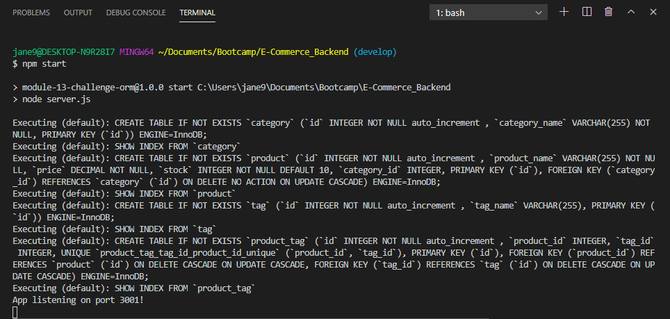

# E-commerce Back End

## Table of Contents
* [Description](#description)
* [Installation](#installation)
* [Usage](#usage)
* [Contributing](#contributing)
* [Tests](#tests)
* [License](#license)
* [Questions](#questions)

## Description <a name="description"></a>
This is the back-end of an e-commerce site written in Javascript and utilizes Express, Sequelize, and MySQL.  Starter code was provided to set up the file structure.  To complete the application functionality, the following code was written:
* Environmental variable file and revisions to server.js to set up the connection to a database using Sequelize  
* Database models for Category, Product, Tags, and ProductTags
* Model associations
* GET, POST, PUT, DELETE api routes  

No front end exists for the application so the application must be run from the command line and tested with user input through Insomnia Core.  The intent of this application was to demonstrate the use of Sequelize in the application of create, read, update, and delete (CRUD) operations on a database.  

## Installation <a name="installation"></a>
To run this application, please do the following: 

1. Clone the application's respository from GitHub onto your local drive.  The GitHub URL is: https://github.com/plainjane99/E-Commerce_Backend.  
2. Set up the ```npm``` package by running the following command in the root directory of the application: 
    
    ```
    npm install
    ```
    
    This will download the application's dependencies into your root directory.  You should now have a folder called ```node_modules``` and a file called ```package-lock.json```.  The ```package-lock.json``` file should include ```mysql2```, ```sequelize```, ```express```, and ```dotenv```.
3. A ```.env``` file will need to be created with the following code:
```
DB_NAME='ecommerce_db'
DB_USER='root'
DB_PW='your-mysql-password-here'
```

## Usage <a name="usage"></a>
Once installation is complete, enter the following into the command line:
1.  Start ```mysql2``` to set up the database.  Enter the following command:

```
npm run sql
```

then enter in your password.  

Once ```mysql2``` is running, type in the following command to initiate the database:

```
source ./db/schema.sql
```
This will create a database called ecommerce_db.  To confirm the database has been added, enter into the ```mysql2``` command line:  ```show databases```.  Once verified, type ```quit``` and ```enter``` to leave ```mysql2```.

2. Seed data has been included with this application.  To add the seed data, type in the following command:

```
npm run seed
```

3. To use the application, type the following into the command line at the root directory of the application:

    npm start
    
The application will start and indicate the server is running, as shown below:



4. Once the server is running, open Insomnia Core to test out the following API routes:

```http://localhost:3001/api/categories```  
```http://localhost:3001/api/products```  
```http://localhost:3001/api/tags```

Single item functions will be accessed through the following routes:
```http://localhost:3001/api/categories/:id```  
```http://localhost:3001/api/products/:id```  
```http://localhost:3001/api/tags/:id```

For a walk-through of this application, please view the following video:

https://drive.google.com/file/d/1c1N5gMVK5aq5QcwczZzw2uZh98-Xy9iM/view?usp=sharing

## Contributing <a name="contributing"></a>
Contributions are welcome.  Please contact me regarding improvements you would like to make.

## Tests <a name="tests"></a>
This application uses Insomnia Core as a testing method since no front-end exists.

## License <a name="license"></a>
This application is covered under the ISC license.

## Questions <a name="questions"></a>
My GitHub username is ```plainjane99```.  Please feel free to peruse my other projects.

If you have any questions regarding this application, please contact me via email at ```jane99hsu@gmail.com```.
  